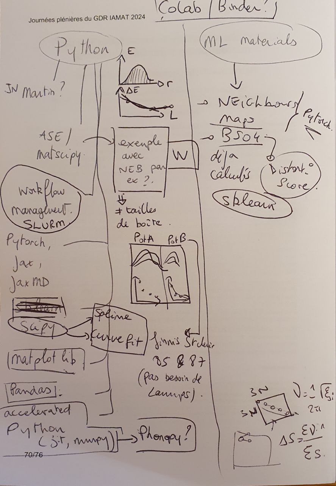

For local deployment you can use conda `conda env create -f modmat.yaml` or pip `pip install -r requirements.txt`

Binder link seems to be working, but does get stuck sometimes. We can make Google Colab versions of the tutorials once the content is ready.

Here the sketch from out discussion in Toulouse, I will add content to the first notebook next week.

